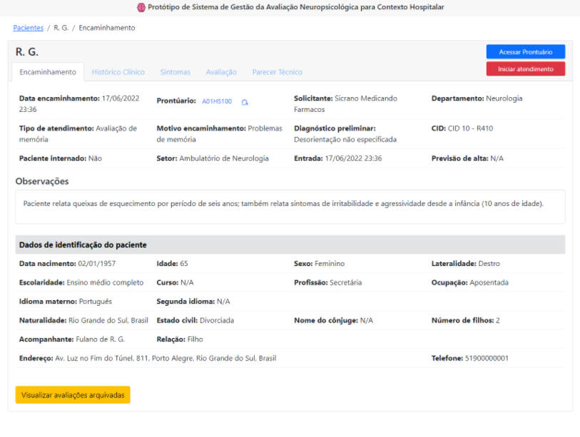

<!-- LANGUAGE -->
<!-- LANGUAGE -->
<!-- LANGUAGE -->
[english](README.md) -
portuguese
   

<!-- HEADER -->
<!-- HEADER -->
<!-- HEADER -->
<h1 align="center">Sistema de Gestão de Avaliação Neuropsicológica</h1>

Sobre a pesquisa e o protótipo desenvolvido no decorrer do mestrado.

   

    

<!-- DATE -->
<!-- DATE -->
<!-- DATE -->

        Feb,
        2019 ~ 
        Nov,
        2022

 

<!-- LOCAL -->
<!-- LOCAL -->
<!-- LOCAL -->

        Universidade Federal de Santa Catarina -
        UFSC

        Centro de Ciências da Saúde -
        CCS

        Programa de Pós-Graduação em Informática em Saúde -
        PPGINFOS

        Mestrado Profissional em Informática em Saúde - 
        Tecnologia de Informação e Comunicação em Saúde/e-Saúde

        Projeto de pesquisa de mestrado -
        Informática em Saúde e Neuropsicologia

 

<!-- TEXT -->
<!-- TEXT -->
<!-- TEXT -->
<!-- goals -->
<!--  just objectives, no results or opinions.-->

Nas universidades brasileiras a principal atividade para a conclusão do mestrado é a pesquisa científica. Desde o início o aluno deve ser capaz de identificar e investigar um problema científico através de um conjunto de procedimentos metodológicos. O processo de pesquisa fica documentado na <a href="https://repositorio.ufsc.br/handle/123456789/231148">dissertação de mestrado</a> que é avaliada em dois momentos: primeiro na etapa de qualificação do projeto onde se destaca a relevância do problema científico; depois na defesa da dissertação onde é avaliado o rigor metodológico e as interpretações dos resultados encontrados na pesquisa. Nas universidades brasileiras o mestrado inicia o aluno na pesquisa acadêmica e por outro lado contribui para que a ciência amplie o conhecimento necessário para compreender determinado problema científico.

<!-- results -->
<!-- just results, no objectives or opinions -->

Em minha pesquisa, os objetivos foram investigar a viabilidade de um sistema de gestão de avaliação neuropsicológica hospitalar que pudesse contribuir para a prática neuropsicológica hospitalar e digitalizar, sistematizar e centralizar dados neuropsicológicos. Escolhi a metodologia Design Science Research, portanto, a pesquisa exigia um processo completo de projeto e engenharia de software: ou seja, levantamento de requisitos para projetar, modelar e prototipar um sistema que se adequasse aos neuropsicólogos no contexto hospitalar. O protótipo funcional foi desenvolvido com o framework frontend VueJs. Por fim, este protótipo foi utilizado para avaliar a viabilidade e usabilidade do sistema proposto com os usuários finais.

<!-- results -->
<!-- just results, no objectives or opinions -->

Essa ideia me veio durante a pós-graduação em neuropsicologia clínica (2018), quando estava escrevendo um artigo de revisão de literatura sobre os usos da informática pela neuropsicologia. Espero que alguém que entre em contato com minha dissertação se sensibilize para fazer pesquisas mais profundas e ajudar em questões sobre teleatendimento, prontuário eletrônico, interoperabilidade, padronização de dados neuropsicológicos, big data, aprendizado de máquina, etc... na área da neuropsicologia.

<!-- conclusion -->
<!-- just opinions, no objectives or results -->

Os resultados identificaram que um sistema de gestão de avaliação neuropsicológica hospitalar poderia melhorar as práticas do neuropsicólogo. A princípio, descobri que é fundamental desenvolver um padrão de transferência de dados neuropsicológicos para evitar que os sistemas desenvolvidos a partir de agora não possam compartilhar dados no futuro. Portanto, a neuropsicologia precisa investir mais em pesquisas científicas para incorporar a informática e estar mais próxima da eSaúde.

<!-- conclusion -->
<!-- just opinions, no objectives or results -->

Se este tema lhe interessar, você pode acessar minha dissertação de mestrado completa na <a href="https://repositorio.ufsc.br/handle/123456789/231148">biblioteca online</a> da universidade. Você também pode assistir a uma  <a href="https://youtu.be/JuxrG9Eq8Zg">gravação da minha defesa de dissertação</a>. E estarei disponível para discutir essa pesquisa, entre em contato comigo.

 

<!-- DOWNLOADS -->
<!-- DOWNLOADS -->
<!-- DOWNLOADS -->

        
        

 
 

<!-- TECH -->
<!-- TECH -->
<!-- TECH -->
## Tech stask
<!-- FRONT STACK -->

        
        
        
        

 

<!-- IMAGES -->
<!-- IMAGES -->
<!-- IMAGES -->
## Illustrative images

<!-- ### Image title -->

        

        

        

        

        

        

        

        

        

        

